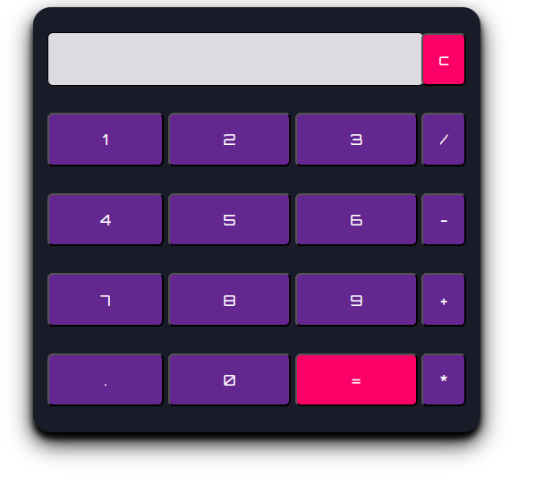

# 🧮 Simple Calculator App

A clean, responsive, and fully functional calculator app made with **HTML**, **CSS**, and **JavaScript**. Perfect for beginners learning front-end development and JavaScript DOM manipulation.

## 🚀 Live Demo

👉 [Live App](https://calculator-mu-opal-13.vercel.app/)

## 🛠️ Tech Stack

- **HTML5**
- **CSS3**
- **Vanilla JavaScript**

## ✨ Features

- Basic arithmetic operations (Add, Subtract, Multiply, Divide)
- Clean and intuitive UI
- Responsive design for all devices
- Error handling for invalid inputs

## 📚 Ideal For

- JavaScript Beginners
- DOM Manipulation Practice
- Front-End Practice Projects
- UI/UX Improvement Exercises

## 📫 Contact Me

- **📧 Email:** muhdzaheermv@gmail.com  
- **🔗 Portfolio:** [https://portfolio-lilac-eight-60.vercel.app/](https://portfolio-lilac-eight-60.vercel.app/)  
- **💼 LinkedIn:** [https://www.linkedin.com/in/muhammed-zaheer-836132244/](https://www.linkedin.com/in/muhammed-zaheer-836132244/)

## ⭐ Like This Project?

If you enjoyed this project or found it useful, please consider giving it a **⭐ star** on GitHub — your support is appreciated!

